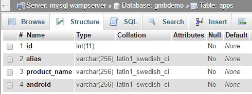
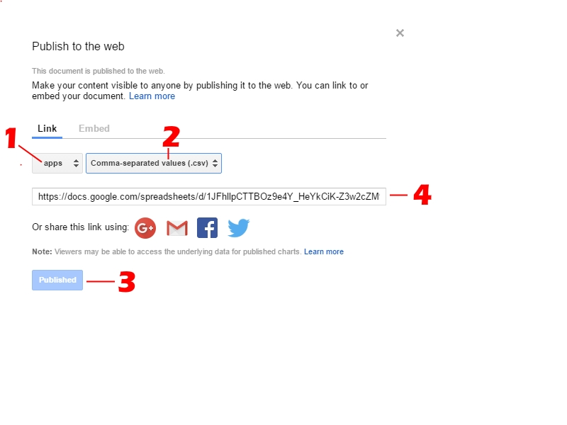
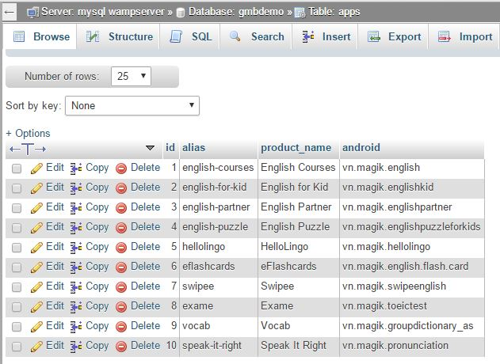
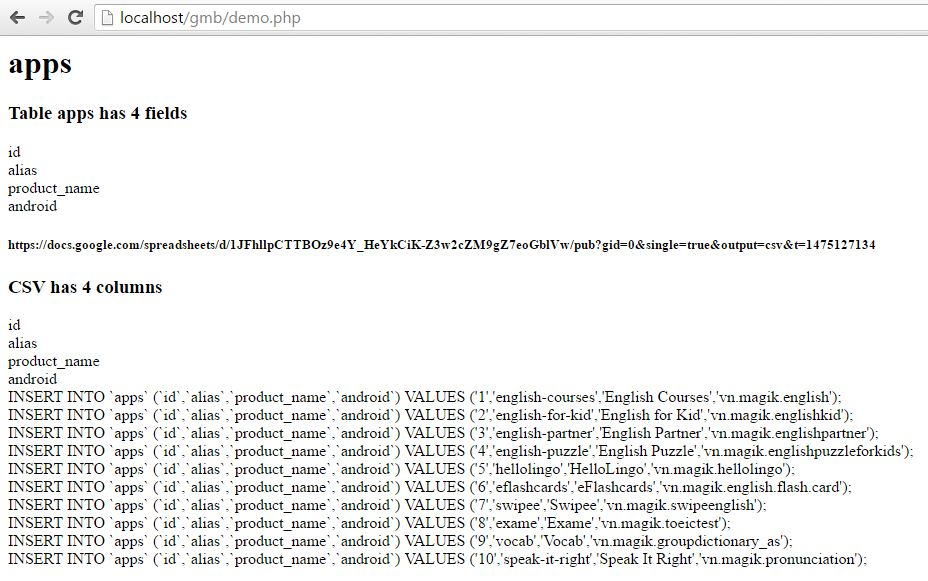

# googlesheets-mysql-bridge
A simple php script help you automatically update a database from sheets ( Goolge Sheets) to MySQL

# sample problems
You have a sheet on google sheets

!(README_images/sheet.JPG)

You have a associated table in SQL database




When you edit sheet, you want changes will be updated to table on database Mysql


# Usage

For a table, you must: 

Step 1 : Ensure name of column headers on sheet are field names on table. If it's wrong, you must rename it.

Step 2 : Publish sheet as csv and get links.
On google sheets, Access menu File >> Publish to the webs
1. select sheet 
2. select publish format is .csv
3. press publish
4. copy link.



Step 3 : just write code
Create new a file named demo.php
```php
<?php
	error_reporting(E_ALL);
	include "googlesheets_mysql_bridge/googlesheets_mysql_bridge.php";

	$bridge = new GoogleSheetsMySQLBridge();
	$bridge->setMYSQLAccess('localhost', 'root', '', 'gmbdemo');
	$bridge->setGoogleSheetsRules(
		array(
			array(
				'from_csv' => 'https://docs.google.com/spreadsheets/d/1JFhllpCTTBOz9e4Y_HeYkCiK-Z3w2cZM9gZ7eoGblVw/pub?gid=0&single=true&output=csv',
				'to_table' => 'apps',
				'sync_type'=> 'delete_and_insert'
			)
		)
	);
	$bridge->sync();
```
Step 4 : run code to sync.
Example: release web with domain http://localhost/gmbdemo.

Just open link http://localhost/gmbdemo/demo.php on browser, you get results:




